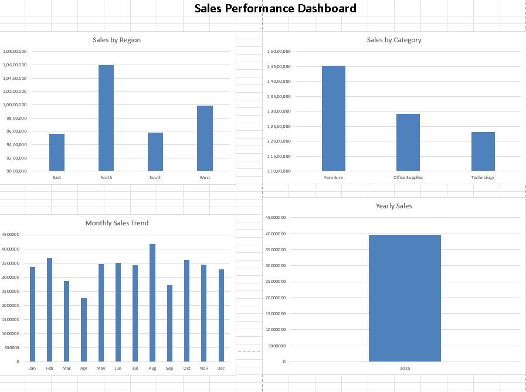

 📊 Sales Performance Dashboard | Microsoft Excel

 Overview
This project demonstrates how Microsoft Excel can be used to transform raw sales data into meaningful business insights. The dataset was cleaned, analyzed, and visualized using Pivot Tables, Pivot Charts, and an interactive dashboard.

 Objectives
- Clean and organize sales data
- Analyze sales performance across different regions and categories
- Track monthly sales trends
- Build a dashboard for easy business reporting

 Features 
✔ Data Cleaning in Excel  
✔ Pivot Tables for analysis  
✔ Pivot Charts for visualization  
✔ Interactive Sales Dashboard  

 Dashboard Preview

 Dashboard Insights
- North region generated the highest sales.
- Furniture contributed the highest sales among all categories.
- Monthly sales trends help identify peak and low-performing months.
- Dashboard provides a quick overview of overall sales performance.

 Files Included
- Sales_Data.xlsx
- Dashboard Screenshot
- README Documentation

 Skills Demonstrated
- Microsoft Excel
- Data Cleaning
- Pivot Tables
- Pivot Charts
- Dashboard Design
- Data Visualization

 Created By
Akanksha
